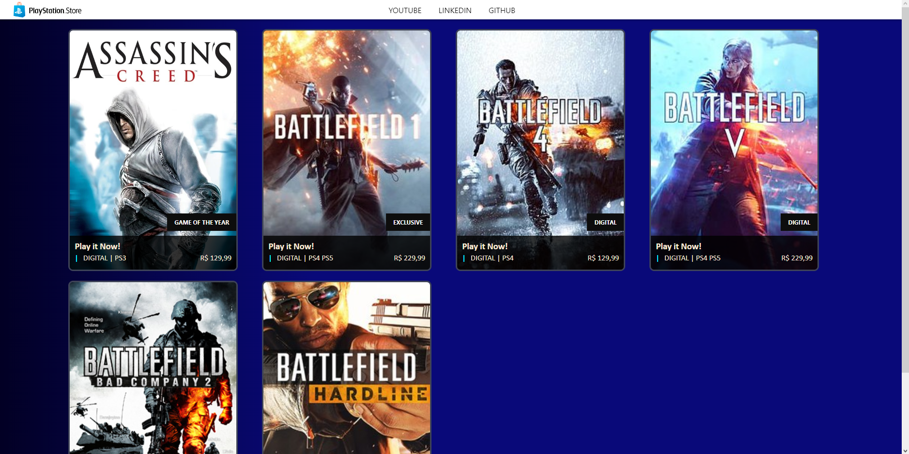

# PSN Store

Este projeto recria a interface inicial da psn-store, loja virtual de jogos da PlayStation. Foi feito para o desafio de projeto do bootcamp Santander 2023 na DIO. Utilizei este projeto para aprender e aplicar conceitos de testes unitários em Angular, todos os componentes criados foram testados. Além disso alterei CSS que achei pertinente e adicionei responsividade.


## Referência

- [DIO](https://web.dio.me/welcome/)


## Stack utilizada

**Front-end:** Angular


## Demonstração




## Rodando localmente

Clone o projeto

```bash
  git clone https://github.com/LuizAGDomingues/psn-store
```

Entre no diretório do projeto

```bash
  cd psn-store
```

Instale as dependências

```bash
  npm install
```

Inicie o servidor

```bash
  ng serve
```


## Autor

- [@LuizAGDomingues](https://github.com/LuizAGDomingues)

